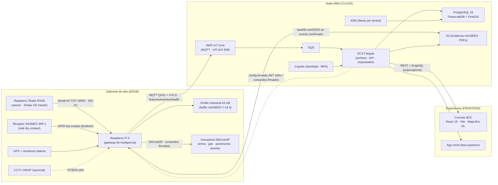

# Blueprint Técnico Maestro — TAKAB Ailert
### Plataforma SaaS multi-tenant de alertamiento sísmico, monitoreo estructural y continuidad operativa (edge + cloud)

> **Documento canónico de arquitectura.** Reemplaza al blueprint exploratorio anterior. Refleja las decisiones ya congeladas del proyecto y define la secuencia de implementación. Convive con `CLAUDE.md`, `TASKS.md`, `USER-STORIES.md`, `RBAC-TAKAB.md`, `db/schema.sql` y `FASE-0-AUDITORIA-Y-PLAN-TAKAB.md`.

---

## 0. Cómo usar este documento (instrucciones para Claude Code)

Estas reglas gobiernan toda la ejecución. Tienen prioridad sobre cualquier inferencia hecha a partir del deck de producto o de documentos exploratorios.

1. **Orden de trabajo = EDGE PRIMERO, luego CLOUD, luego FRONTEND.** Se programa completa la inteligencia del gabinete (Raspberry Pi 5) antes de tocar la nube. La nube se construye sobre contratos ya validados en el edge. El frontend consume la nube ya existente. Ver §13.
2. **No auto-atribución en el control de versiones.** Los commits **no** deben incluir a Claude/Anthropic como coautor ni footers de generación automática. Prohibido:
   - `Co-Authored-By: Claude <...>`
   - `🤖 Generated with Claude Code` (o cualquier variante)
   - Cualquier trailer, firma o mención de asistente de IA en el mensaje de commit, PR o changelog.
   El autor único de todos los commits es Mauricio. Los mensajes siguen Conventional Commits, limpios y sin adornos.
3. **Separación estricta edge/cloud.** Nada latency-sensitive o de vida/seguridad puede depender de la nube. Ver §2.
4. **Nada de IA en la ruta determinista de seguridad.** El motor de reglas, el cálculo de features sísmicas y el disparo de actuadores son 100% deterministas y testeados exhaustivamente. La IA queda fuera del MVP; cuando entre, será solo advisory.
5. **Contra el deck:** el mockup del SOC muestra funcionalidades **diferidas** (T-MINUS countdown, magnitud preliminar). **No implementarlas.** Ver §14.
6. **Compliance como restricción dura:** auditoría, evidencia de incidentes y dictámenes **nunca** se podan por retención (NOM-003-SCT). Ver §9.
7. Toda tarea produce: rama → implementación → tests → PR. CI (`api` + `web` + nuevo job `edge`) debe pasar antes de merge. Mauricio revisa y hace merge manualmente.
8. Estado actual: **T-1.1 (fundación del monorepo) está COMPLETA** — CI verde en el primer run, PR #1 abierto. No rehacerla; construir encima.

---

## 1. Misión y alcance

TAKAB Ailert es una plataforma comercial que entrega tres funciones a autoridades de Protección Civil, instituciones de gobierno e instalaciones críticas (hospitales, universidades, industria) en México:

- **Detección y alertamiento sísmico** en segundos, con el receptor **SASMEX/WR-1** como canal primario y sensado local como respaldo.
- **Actuación autónoma de seguridad** en sitio: sirena, cierre de válvulas de gas, liberación de retenedores de puerta.
- **Continuidad operativa y triage post-sismo**: dictamen operativo preliminar, evidencia instrumental y coordinación multi-sitio para priorizar inspección y recuperación.

Modelo comercial dual: **SOC operado por TAKAB** y **despliegue por tenant**. La plataforma es multi-tenant con aislamiento lógico (RLS) o dedicado (DB aislada) según el cliente.

**Límite de responsabilidad del producto:** TAKAB entrega un *dictamen operativo preliminar* y *riesgo instrumental*; no sustituye la evaluación estructural formal ni certifica reingreso seguro sin firma de ingeniería. Esto es principio de diseño, no disclaimer decorativo.

---

## 2. Principios arquitectónicos (congelados)

| # | Principio | Implicación de implementación |
|---|---|---|
| P1 | **Autonomía local total** | SeedLink, features PGA/PGV, motor de reglas, disparo de actuadores, señal WR-1 y buffer offline viven en el edge. Con WAN caída, el sitio se protege solo. |
| P2 | **Separación estricta edge/cloud** | La nube coordina, almacena, notifica, factura y enriquece post-evento. Nunca está en la ruta crítica de actuación. |
| P3 | **Independencia de firmware** | El Raspberry Shake (Shake OS) queda intacto: es solo sensor. El Pi 5 es un equipo separado, versionable, con hardening propio (mTLS, X.509) y auditable, sin riesgo para el instrumento sísmico. |
| P4 | **Determinista ≠ IA** | Cálculo sísmico y decisiones de seguridad son deterministas. Los LLM/modelos nunca generan cálculos sísmicos ni salidas ShakeMap. |
| P5 | **Logging por evento, no por intervalo** | Registro por transición de estado + heartbeat periódico. Nada de logging continuo por intervalo para `rule_evaluations` o salud de dispositivo. |
| P6 | **Sin streaming de forma de onda cruda** | El waveform 200 Hz no se sube en continuo. El miniSEED crudo se sube a S3 **solo** en eventos confirmados. |
| P7 | **Degradación elegante** | Nube caída → edge sigue operando. Edge caído → nube muestra último estado confiable y degrada el incidente a "verificación manual requerida". Notificación fail-open (§5.6). |
| P8 | **Auditable de extremo a extremo** | Toda medición, decisión, comando y notificación queda trazable e inmutable. |
| P9 | **Crecimiento por sitios, no por calendario** | El almacenamiento de largo plazo lo determina el conteo de tenants/sitios, no el paso del tiempo (gracias a P5 y P6). |

---

## 3. Topología del sistema



Sitios de referencia (del deck, para fixtures/seed): Planta Cholula (Edif. A/B), Hospital General, Corporativo CDMX, CD Tehuacán, Bodega Atlixco, Planta Zacatlán. Estados de gabinete: `OPERATIVO`, `DEGRADADO`, `SIN ENLACE`.

---

# CAPA EDGE — Raspberry Pi 5 (SE CONSTRUYE PRIMERO)

## 4.1 Hardware del gabinete

| Componente | Rol | Notas |
|---|---|---|
| Raspberry Shake RS4D | Sensor (velocidad vertical + acelerómetro 3D) | **Solo sensor.** Expone SeedLink en TCP 18000. Shake OS no se modifica. |
| Raspberry Pi 5 | Gateway de inteligencia | Ejecuta todo el software TAKAB del edge. |
| NVMe industrial 64 GB | Buffer circular miniSEED | Uso real ~10–16 GB (ring 7–14 días). |
| UPS con monitoreo | Respaldo eléctrico | Reporta `RED ELÉCTRICA %`, `RESPALDO Xh Ym`, modo `EN BATERÍA`. |
| Receptor SASMEX WR-1 | Alerta temprana regional | Salida relé **dry-contact → GPIO**. Boolean puro. |
| Interfaz BACnet/IP | Control de actuadores | Sirena, válvulas de gas, ascensores/montacargas, retenedores de puerta. |
| CCTV ONVIF (opcional) | Verificación visual | RTSP/H.264; bookmark por incidente. |
| Red | Ethernet **obligatorio** | No usar Wi-Fi integrado (latencia/pérdida). |

## 4.2 Servicios/módulos del Pi 5

Cada módulo es un servicio supervisado (systemd o contenedor) con responsabilidad única y contrato claro.

| Módulo | Responsabilidad | Salida |
|---|---|---|
| `seedlink` | Cliente SeedLink contra RS4D (TCP 18000). Reconexión con backoff, medición de lag. | Paquetes miniSEED por canal (Z + horizontales, 200 Hz). |
| `signal` | Decodifica miniSEED y calcula features **agregadas a 1 s**: PGA, PGV, RMS, STA/LTA, clipping, health_score. | Registros de feature 1 s. |
| `buffer` | Ring buffer miniSEED crudo en NVMe (7–14 días). Extrae ventana del evento para subir. | Archivo miniSEED de ventana de evento. |
| `sasmex` | Escucha el relé WR-1 vía GPIO (boolean). **Canal primario de alertamiento.** | Señal de alerta SASMEX activa. |
| `rules` | **Motor de reglas determinista.** Evalúa features vs umbrales por edificio (T1 cautela / T2 disparo, PGA y PGV), correlación y gating por salud. Consume `sasmex`. Decide tier/severidad y dispara actuadores. Sin IA. | Decisión tierizada + comandos de actuador + evento local. |
| `actuators` | Adaptador BACnet/IP. Ejecuta comandos (sirena/gas/ascensores/puertas) y confirma ejecución. | ACK de actuador con timestamp (`T+0.42s`, etc.). |
| `quorum` | Correlación local anti-falso-positivo (secundario). Ventana 2–5 s. Coopera con la nube para el quórum de red (§4.5). | Evidencia de corroboración multi-nodo. |
| `cloud` | Conector MQTT (QoS 1, mTLS) hacia AWS IoT Core. **Cola durable offline** con backfill al reconectar. Recibe comandos remotos firmados. | Publicación de features/eventos/health/ACKs. |
| `health` | Autodiagnóstico silencioso: NTP offset, lag SeedLink, packet loss, estado UPS, temperatura, estado de actuadores. Logging por transición + heartbeat. | Snapshots de salud por evento. |
| `config` | Store local de umbrales/reglas/tenant. Sincronización desde la nube (JWT firmado, ≤60 s). | Config activa versionada. |
| `security` | mTLS/X.509 por gateway, verificación de comandos firmados, store de nonces, rotación de credenciales. | — |
| `supervisor` | Arranque, watchdog, aislamiento de fallos, orden de dependencias entre módulos. | — |

**Regla de oro del edge:** `sasmex` + `signal` → `rules` → `actuators` funciona **sin nube**. `cloud` solo transporta y recibe config/comandos; nunca es prerequisito para actuar.

## 4.3 Stack técnico del edge

- **Lenguaje:** Python 3.12, gestionado con **uv**.
- **Sísmica:** ObsPy (cliente SeedLink + decodificación miniSEED), NumPy/SciPy (features y filtros).
- **MQTT:** AWS IoT Device SDK (o `paho-mqtt`) con TLS mutuo.
- **BACnet/IP:** `BAC0` / `bacpypes3`.
- **GPIO (WR-1):** `gpiozero` / `lgpio`.
- **Cola offline:** SQLite (WAL) o cola en disco; idempotencia por `event_id`/`nonce`.
- **Runtime:** systemd units (o Docker Compose ligero) + watchdog.
- **Objetivo de latencia:** decisión local edge p95 **< 1 s**.

## 4.4 Estructura de directorios del edge

```
edge/
  pyproject.toml            # uv
  takab_edge/
    seedlink/               # cliente SeedLink + reconexión
    signal/                 # features 1s (PGA, PGV, RMS, STA/LTA)
    buffer/                 # ring buffer miniSEED en NVMe
    sasmex/                 # listener GPIO WR-1
    rules/                  # motor determinista + esquema de umbrales
    actuators/              # adaptador BACnet/IP + mock de simulación
    quorum/                 # correlación local / cooperación de red
    cloud/                  # conector MQTT + cola offline + backfill
    health/                 # autodiagnóstico
    config/                 # store local + sync firmada
    security/               # mTLS, comandos firmados, nonces
    supervisor.py           # orquestación de servicios
  systemd/                  # unit files
  simulators/               # generador de eventos + RS4D/WR-1 simulados (dev sin hardware)
  tests/                    # unit + integración (hardware-in-the-loop opcional)
```

> Incluir **simuladores** de RS4D (feed SeedLink sintético), de WR-1 (toggle de GPIO) y de BACnet, para desarrollar y testear el edge completo sin hardware físico.

## 4.5 Lógica de alertamiento (edge)

**Canal primario — SASMEX / WR-1 (boolean):** al cerrar el relé, `rules` dispara la secuencia de protección inmediata (sirena + secuencia BACnet) de forma autónoma. Es el canal más rápido y autoritativo para alerta temprana regional.

**Secundario A — umbral local PGA/PGV:** detección en sitio por edificio (T1 cautela / T2 disparo) para eventos locales/cercanos no cubiertos por SASMEX, o para corroboración.

**Secundario B — quórum colaborativo (anti-falso-positivo):** corroboración multi-estación (**≥3 nodos**, ventana de correlación **2–5 s**). Eleva la confianza del incidente y alimenta el dictamen. Se coordina a nivel de red (nube) usando los eventos que cada edge publica; **no** bloquea la actuación local autónoma.

Tiers deterministas (umbrales configurables por edificio, definidos por ingeniería):

| Tier | Condición | Acción |
|---|---|---|
| `normal` | Sin excedencias, salud OK | Solo telemetría |
| `watch` | Excedencia menor / un nodo, evidencia débil | Notificar operador; sin bloqueo automático |
| `restricted` | Excedencia confirmada por múltiples sensores o utilities críticas afectadas | Restringir accesos, retornar ascensores, notificar brigadas |
| `evacuate_or_hold` | Excedencia mayor + correlación alta + utilities críticas | Sirena general, cierre de gas, hold, escalamiento mayor |
| `manual_only` | Sensores degradados o datos contradictorios | No automatizar reingreso; decide humano |

Umbrales de referencia por tipo de instalación (del deck; calibrar por tipología/altura): Hospitales 0.040–0.060 g · Industriales 0.080–0.120 g · Corporativos 0.100–0.150 g. Cada umbral tiene banda `cautela` y `disparo` para PGA (g) y PGV (cm/s).

## 4.6 Seguridad del edge

- Identidad de dispositivo: **certificado X.509 por gateway**, TLS mutuo para MQTT.
- Comandos remotos de actuador (desde nube): **firmados**, con **MFA** del operador, **rate limiting**, **nonce** (anti-replay) y **ACK de ejecución** obligatorio.
- Config entrante: **JWT firmado**, verificada antes de aplicar; versionada y reversible.
- Rotación de credenciales soportada sin downtime del path de seguridad.

---

# CAPA CLOUD — AWS (SE CONSTRUYE DESPUÉS DEL EDGE)

## 5.1 Servicios AWS

| Servicio | Rol |
|---|---|
| **AWS IoT Core** | Broker MQTT + device gateway. Auth por X.509 (mTLS). Regla IoT → SQS. |
| **SQS** | Desacople de ingesta (features, eventos, health, ACKs). |
| **ECS Fargate** | Workers de ingesta, API, motor de incidentes, orquestador de notificaciones, etc. |
| **PostgreSQL 16 + TimescaleDB + PostGIS** | Core relacional + hypertables de series de tiempo + geoespacial. |
| **S3** | Evidencia miniSEED (solo en eventos), fotos de inspección, PDFs de dictamen, exportaciones. |
| **Cognito** | Identidad de usuarios (SOC web, móvil, interno TAKAB). MFA. Grupos/claims para RBAC. |
| **KMS** | Llaves de cifrado **por tenant** (AES-256 at-rest). |

## 5.2 Flujo de ingesta

```
Edge → MQTT/mTLS → IoT Core → IoT Rule → SQS → Fargate ingest worker
  ├─ features 1s        → TimescaleDB (waveform_features_1s)
  ├─ evento confirmado  → PostgreSQL (incidents/events) + S3 (miniSEED de ventana)
  └─ health snapshot    → TimescaleDB (device_health, por transición)
```

## 5.3 Servicios backend (Fargate)

| Servicio | Responsabilidad |
|---|---|
| Ingest workers | Consumen SQS; escriben features/eventos/health idempotentemente. |
| Incident engine | Correlación, corroboración de quórum de red, deduplicación, ciclo de vida del incidente. |
| Dictamen service | Dictamen automático preliminar: `NO HABITAR · INSPECCIÓN` / `HABITAR · MONITOREO` / `OPERACIÓN NORMAL`, según severidad/PGA + regla de nodos. Genera registro NOM-003 inmutable y PDF. |
| Notification orchestrator | Cascada de canales secundarios (§5.6). |
| API service | REST (FastAPI) + GraphQL con subscriptions. |
| Config sync service | Publica umbrales/reglas firmados a los edges (JWT, ≤60 s). |
| Command service | Comandos remotos de actuador firmados (MFA, nonce, rate limit, ACK). |
| Audit & compliance | Log inmutable, retención NOM-003 (sin poda). |
| Billing & metering | Medidores por tenant (sitios activos, mensajes, GB, incidentes). |

## 5.4 Modelo de datos

**Relacional (PostgreSQL + PostGIS)** — fuente de verdad del negocio:

`tenants` · `sites` · `buildings` · `floors` · `devices` · `device_bindings` · `rule_sets` · `incidents` · `incident_actions` · `dictamens` · `notification_jobs` · `integrations` · `audit_log` · `billing_meters_daily`

Claves: `tenant_id` en toda tabla multi-tenant; `geom geography(point,4326)` en `sites`; **RLS default-deny** en todas las entidades multi-tenant.

**Series de tiempo (TimescaleDB hypertables)**:

| Tabla | Granularidad | Política |
|---|---|---|
| `waveform_features_1s` | 1 s por canal (PGA, PGV, RMS, STA/LTA, clipping, health) | Continua; **compresión de chunk tras 7 días** |
| `device_health` | Por transición + heartbeat (no por intervalo) | Compresión tras 7 días |
| `site_state_snapshots` | Estado agregado del sitio | Compresión tras 7 días |
| `rule_evaluations` | Por transición de estado | Event-driven, sin logging continuo |
| `materialized_site_metrics_1m` | Continuous aggregate 1 min | Refresco automático |
| `materialized_site_metrics_1h` | Continuous aggregate 1 h | Refresco automático |

**Objeto (S3)**: miniSEED de evidencia (solo evento confirmado), fotos, PDFs. Índice por puntero en relacional. **Nunca podado** para evidencia/dictamen (§9).

> `db/schema.sql` es la fuente de verdad del DDL. Este blueprint describe intención; el DDL manda.

## 5.5 APIs

- **REST (FastAPI + Pydantic):** ingesta desde edge (mTLS), gestión de sitios/reglas/incidentes, acuse, dictámenes, exportación miniSEED, pruebas de canal.
- **GraphQL con subscriptions:** para la Consola SOC en vivo. El deck muestra explícitamente `SUBSCRIPTION · GraphQL · LIVE` en incidentes abiertos y forma de onda. Implementar suscripción de incidentes y de estado de sitio sobre WebSocket.

## 5.6 Cascada de notificaciones (canales secundarios · FAIL-OPEN)

El canal **primario de vida/seguridad es la sirena local en sitio** (edge). La cascada de nube es para notificar personas/sistemas:

1. **API Webhook** — POST JSON con firma **HMAC**.
2. **WhatsApp Business** — plantilla aprobada (Cloud API).
3. **SMS** — ruta dedicada Telcel/AT&T, entrega ≤30 s.
4. **Correo** — SMTP-relay con DKIM/SPF.

Operación normal = cascada secuencial con escalamiento. **Degradado (edge `SIN ENLACE`) = fail-open: la nube dispara todos los canales en paralelo** para garantizar aviso (se prefiere sobre-notificar a callar).

---

## 6. Arquitectura de datos y almacenamiento (tres niveles)

| Nivel | Dónde | Qué | Política |
|---|---|---|---|
| 1 · Hot crudo | Edge (NVMe 64 GB) | miniSEED crudo 200 Hz | Ring 7–14 días (~10–16 GB); a S3 solo en evento |
| 2 · Features | Cloud (TimescaleDB) | Features 1 s | Continuo; compresión tras 7 d; agregados 1m/1h |
| 3 · Evidencia | Cloud (S3 + relacional) | miniSEED de evento, fotos, PDFs, auditoría, dictámenes | **Inmutable, sin poda** (NOM-003) |

Logging **por transición de estado + heartbeat** (no por intervalo). El crecimiento de largo plazo lo determina el número de sitios/tenants, no el calendario.

---

## 7. Frontend — Consola SOC (target del deck)

Stack: **React 18 · TypeScript · Vite · TanStack Query · zustand · MapLibre GL JS**. Cuatro pantallas objetivo (ver deck de producto, ID Canva `DAHJuwEIp0k`):

1. **Consola C4I — Live Wall:** mapa de sitios con intensidad MMI, alerta activa, incidentes abiertos en vivo (GraphQL subscription), detalle de sitio (sismograma live, PGA/PGV, NTP offset/clipping/packet loss), actuadores BACnet con ACKs, verificación CCTV ONVIF.
2. **Flota Edge — Gabinetes:** inventario de gateways (MQTT lag, SeedLink lag, UPS %, actuadores armados), estados `OPERATIVO`/`DEGRADADO`/`SIN ENLACE`, autodiagnóstico silencioso.
3. **Triage Estructural — Historial:** cumplimiento NOM-003-SCT, historial de eventos, dictamen preliminar, regla "3 Nodos"/quórum con offsets, exportar miniSEED + PDF.
4. **Matriz Multi-Tenant — Umbrales:** aislamiento (lógico vs dedicado), umbrales por tipo de instalación, cascada de notificación, sync firmada al edge.

Móvil (fase posterior): acuse, escalamiento, inspección de campo con checklist/fotos/firma, offline.

---

## 8. RBAC y seguridad

`RBAC-TAKAB.md` es la **fuente de verdad**: **11 roles** sobre tres superficies (SOC web, app móvil, interno TAKAB). Restricciones no negociables a implementar:

- **`gov_operator` (Protección Civil): solo lectura + acuse.** No opera actuadores.
- **Activación manual de sirena:** requiere **quórum de dos personas** (ocupantes) dentro de **30 s**.
- **Control remoto de actuadores:** comandos **firmados** + **MFA** + **rate limiting** + **nonce** + **ACK de ejecución**.
- IAM: usuarios web/móvil vía **Cognito/OIDC + MFA**; máquinas vía `client_credentials`; dispositivos vía **mTLS + X.509 por gateway**.
- Propagar `tenant_id` + scope a PostgreSQL; **RLS default-deny**.
- Cifrado: TLS en tránsito, AES-256 at-rest con **KMS por tenant**; `pgcrypto` para campos sensibles (teléfonos, correos, secretos de webhook).
- Alinear con OWASP API Top 10 (broken auth, object-level authz, unrestricted resource consumption — relevante por costo por request de SMS/WhatsApp).

---

## 9. Cumplimiento — NOM-003-SCT

- `audit_log`, evidencia de incidentes y `dictamens` son **inmutables** y **exentos de poda por retención**.
- Todo dictamen queda con base (`ruleSetVersion`, evidencia, notas) y firma (`signedBy`).
- Exportación de evidencia (miniSEED + PDF de dictamen) disponible por incidente.
- Considerar LFPDPPP para datos personales (avisos de privacidad, consentimiento, derechos ARCO) desde el diseño.

---

## 10. Multi-tenant

- **Lógico:** shared DB + **row-level security** (small/medium).
- **Dedicado:** DB aislada (clientes críticos, p. ej. Secretaría de Salud).
- Aislamiento activo por defecto: schema por tenant, RLS, AES-256 at-rest, llaves KMS por tenant.
- Umbrales y cascadas de notificación se configuran por tenant/tipo de instalación y se sincronizan firmados al edge (≤60 s).

---

## 11. Estructura del monorepo

```
takab/
  edge/                 # Raspberry Pi 5 gateway (Python 3.12 · uv)   [NUEVO — se hace PRIMERO]
  api/                  # backend cloud (FastAPI + GraphQL)           [existe]
  web/                  # Consola SOC (React 18 · Vite)               [existe]
  infra/                # IaC AWS (CDK o Terraform)
  db/                   # schema.sql + migraciones
  shared/               # contratos compartidos (JSON Schema/Pydantic/protobuf)
  takab-docs/           # CLAUDE.md · TASKS.md · USER-STORIES.md · RBAC-TAKAB.md · PROMPT-XX · este blueprint
  .github/workflows/    # CI: jobs api + web + edge
```

Agregar job `edge` al pipeline de CI (lint + unit + integración con simuladores).

---

## 12. Convenciones de desarrollo

- **Commits:** Conventional Commits, autor único Mauricio. **Prohibido** cualquier coautoría o footer de IA (ver §0.2).
- **Python:** 3.12, `uv` para dependencias y entornos.
- **Flujo:** una rama y un PR por tarea; CI verde obligatorio; merge manual por Mauricio.
- **Determinismo de seguridad:** motor de reglas y cálculo de features con cobertura de tests exhaustiva y casos borde (clipping, saturación, dropout, doble disparo).
- **Idempotencia:** ingesta y comandos idempotentes por `event_id`/`nonce`.
- **Sin IA en path crítico** (P4). Sin streaming crudo continuo (P6).
- **Documentación primero:** actualizar `CLAUDE.md`/`TASKS.md` cuando cambie un contrato.

---

## 13. Roadmap de implementación — EDGE FIRST

> Secuencia recomendada. Mapear/refinar contra `TASKS.md` (T-1.2…T-1.21) conservando **T-1.1 completa**. No avanzar a una fase hasta cerrar la anterior con tests verdes.

### Fase A — EDGE (Raspberry Pi 5) · primero

| WP | Trabajo | Entregable de aceptación |
|---|---|---|
| A0 | Scaffolding `edge/` (uv, pyproject, supervisor, CI job `edge`) + **simuladores** RS4D/WR-1/BACnet | `pytest` verde en CI sin hardware |
| A1 | `seedlink`: cliente contra RS4D, reconexión, medición de lag | Consume feed simulado 200 Hz estable |
| A2 | `signal`: features 1 s (PGA, PGV, RMS, STA/LTA) + clipping/health | Features correctas vs señales de referencia |
| A3 | `buffer`: ring miniSEED en NVMe + extracción de ventana de evento | Retención 7–14 d; extrae ventana correcta |
| A4 | `sasmex`: listener GPIO WR-1 (boolean) | Detecta toggle simulado con latencia < objetivo |
| A5 | `rules`: motor determinista tierizado + umbrales por edificio | Cobertura de todos los tiers y casos borde |
| A6 | `actuators`: adaptador BACnet/IP + mock + ACKs | Secuencia sirena/gas/ascensores/puertas con ACK |
| A7 | `health`: autodiagnóstico por transición + heartbeat | Snapshots correctos (NTP, lag, packet loss, UPS) |
| A8 | `cloud`: MQTT mTLS + **cola offline** + backfill | Sobrevive WAN down y hace backfill idempotente |
| A9 | `config` + `security`: sync JWT + comandos firmados + nonce | Rechaza comando no firmado/replayed |
| A10 | Integración edge end-to-end (opcional hardware-in-the-loop) | Evento simulado → actuación autónoma sin nube |

### Fase B — CLOUD (AWS) · después del edge

| WP | Trabajo |
|---|---|
| B1 | AWS IoT Core + provisioning X.509 + regla → SQS |
| B2 | Ingest workers (Fargate) idempotentes desde SQS |
| B3 | `db/schema.sql`: PostgreSQL 16 + TimescaleDB (hypertables, compresión 7 d, agregados 1m/1h) + PostGIS + RLS |
| B4 | Incident engine + corroboración de quórum de red |
| B5 | Dictamen service (NOM-003) + generación de PDF |
| B6 | Notification orchestrator (cascada + fail-open) |
| B7 | API REST (FastAPI) + GraphQL subscriptions |
| B8 | Cognito + RBAC (11 roles) + MFA |
| B9 | Config sync (≤60 s, JWT) + command service (firmado/MFA/nonce/rate-limit/ACK) |
| B10 | Audit/compliance inmutable + billing/metering |

### Fase C — FRONTEND · sobre la nube existente

| WP | Trabajo |
|---|---|
| C1 | Consola C4I (mapa MapLibre, incidentes live GraphQL, detalle de sitio) |
| C2 | Flota Edge (inventario/salud de gabinetes) |
| C3 | Triage estructural (historial, dictamen, quórum, export) |
| C4 | Matriz multi-tenant (umbrales, cascada, sync) |
| C5 | App móvil (acuse, inspección, offline) — fase posterior |

---

## 14. Fuera de alcance / diferido explícito

**No implementar en el ciclo actual** (aparecen en el deck de producto como visión, no como spec):

- **T-MINUS countdown** — WR-1 es boolean; no hay dato de ETA.
- **Magnitud preliminar** en UI — WR-1 no provee magnitud.
- **Streaming continuo de forma de onda cruda** a la nube (P6).
- **IA en la ruta determinista de seguridad** (P4).
- **Microservicio "mini-ShakeMap"** (scipy/pykrige, PostGIS, MapLibre) — fase futura.
- **Modificar el Shake OS** — el RS4D es solo sensor (P3).

---

## 15. Supuestos a validar con proveedor (Raspberry Shake)

Pendiente de la reunión con Raspberry Shake; validar antes de congelar detalles del edge:

- Comportamiento de SeedLink en producción (estabilidad, reconexión, latencia real).
- Semántica exacta de la señal WR-1/SASMEX (duración de cierre, rebote, latching).
- Gestión de firmware, SLA/RMA y privacidad de datos en la red pública Shake.

Ajustar §4.1–§4.5 según las respuestas.

---

*Fin del blueprint. Fuente de verdad para DDL: `db/schema.sql`. Para RBAC: `RBAC-TAKAB.md`. Para backlog: `TASKS.md`.*
